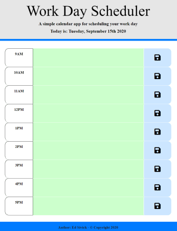
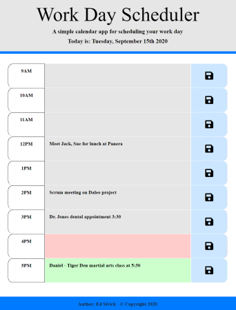

# Work_Day_Scheduler
___
## Objective
Create a daily planner to manage time effectively by posting hourly events and/or tasks into assigned timeblocks.  The current day will be displayed at the top of the calendar.  Timeblocks in the form of rows are assigned for standard business hours (9AM to 5PM).  When viewing timeblocks for the current day, each block is color coded to indicate whether that specific block is in the past, present, or future.  When the user clicks on a timeblock, they are able to enter an event or task associated with that time period.  They can save the information by pressing the corresponding save button for that timeblock.  The information is then saved into local storage.

___
## Layout: index.html
The HTML file was built using primarily Bootstrap components. A **jumbotron** was used in the `header` of the code to provide a brief description of the app, and display the date provided by moment.js (https://momentjs.com/). The `main` element for the schedule was built using the Bootstrap grid system.  It consists of 9 rows, and each row has has three columns: **col-md-2**, **col-md-8**, and **col-md-2**.
- the first column displays the associated time field (9AM - 5PM)
- the second column displays the input textarea for adding events or tasks during that specific time field
- the third column displays the save button field and icon from Font Awesome which includes a 30px font-size **save icon** with code snippet from Codesprogram (https://www.codesprogram.com/web-icon/font-awesome-save-icon)   
A sticky footer was added to display the Author and Copyright year.  
  
___
## Layout: style.css
The CSS file utilized styling that allowed the HTML elements in the app to be responsive, giving it the ability to fit multiple screen sizes.  Color selections for the time variations of **previousTime**, **currentTime**, and **futureTime** are lighter tones of **gray**, **red**, and **green** respectively .  The save icon was given a color black with a background of a lighter blue, allowing it to stand out.  A Times New Roman font was used throughout the page for consistency.  The sticky footer was styled in the same manner as the previous "Code Quiz" project.

___
## Layout: script.js
The JavaScript code utilizes time formats from moment.js and primarily 4 functions. The **startScheduler()** function initializes the app wih an empty object array in storage, and pushes any new events that are added to it in local storage using JSON stringify. The **showScheduler()** function utilizes JSON parse to retrieve the events data from local storage and populate it to the appropriate time and textarea fields. The **startTimeFields()** function determines to add/removeClass for the CSS style background color to use based on the **HourNow** or current time of day. The **saveTask()** function determines which save button associated with the corresponding hour is pressed, and saves the added tasks to local storage using JSON stringify.

___
## Summary
Scheduler apps are an important tool utilized by many individuals for organizing professional and personal events/tasks.  There is an abundance of them available on the internet, and both functionality and visual appearance are equally important to users (in my opinion).
This assignment was challenging, and I found myself having to use resources such as Stack Overflow to research the syntax and proper use of moment.js, Bootstrap grid functionality for textarea, and the each() function. 

## Application Links and Images  
**Links:**  
Application link: (https://ed-sivick.github.io/5-Work_Day_Scheduler/)  
index.html code: (https://github.com/ed-sivick/5-Work_Day_Scheduler/blob/master/index.html)  
JavaScript.js code: (https://github.com/ed-sivick/5-Work_Day_Scheduler/blob/master/assets/script.js)  
style.css code: (https://github.com/ed-sivick/5-Work_Day_Scheduler/blob/master/assets/style.css)

**Application Image Examples:** Hover the mouse over each image for a brief description. 

  
  
  
  

  

  
  
  
  
